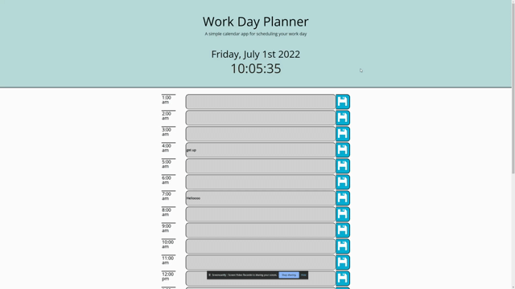

# Day-planner

## Description
This application is a day planner designed to allow you schedule your day as it progresses.
The date and time down to the second are displayed at the top of the page. Next, the application has
a box with the coresponding hour for every hour in the day.  The current hour block is colored red, while
the hours that have already passed are grey and those that are still yet to come 
are colored green.  Each of these boxes has a text area and a coresponding save button that allows the user to 
write what they want to do in those hours and save it so that it continues to display upon refresh.

## Technologies Used
* HTML
* CSS
* Javascript
* gitbash
* github
* bootstrap
* Visual Studio Code
* JQuery
* Momentjs

## Deployed Link

https://ltmccarthy9.github.io/Day-planner/   <-----------

## Code 

This function selects each hour block and grabs it's id that corresponds to the hour and
determines where it is relationally to the current hour, and coloring it given it's status.
Necessary to easily display where in the day you are.
```
    var currentHour = moment().hour();
    console.log(currentHour);
    changeColor();
    setInterval(changeColor, 60000);
    function changeColor() {
        $(".time-block").each(function(){
            var hour = parseInt($(this).attr("id"));
            console.log(hour);
            if (currentHour > hour) {
                $(this).removeClass("present");
                $(this).removeClass("future");
                $(this).addClass("past");
            }else if (currentHour === hour){
                $(this).removeClass("past");
                $(this).addClass("present");
            }else {
                $(this).removeClass("past");
                $(this).removeClass("present");
                $(this).addClass("future");
            }
        })
    }
```

## Demonstration



## Me

LinkedIn: https://www.linkedin.com/in/liam-mccarthy-b06b9a218/

## License

MIT License

Copyright (c) 2022 Liam McCarthy

Permission is hereby granted, free of charge, to any person obtaining a copy
of this software and associated documentation files (the "Software"), to deal
in the Software without restriction, including without limitation the rights
to use, copy, modify, merge, publish, distribute, sublicense, and/or sell
copies of the Software, and to permit persons to whom the Software is
furnished to do so, subject to the following conditions:

The above copyright notice and this permission notice shall be included in all
copies or substantial portions of the Software.

THE SOFTWARE IS PROVIDED "AS IS", WITHOUT WARRANTY OF ANY KIND, EXPRESS OR
IMPLIED, INCLUDING BUT NOT LIMITED TO THE WARRANTIES OF MERCHANTABILITY,
FITNESS FOR A PARTICULAR PURPOSE AND NONINFRINGEMENT. IN NO EVENT SHALL THE
AUTHORS OR COPYRIGHT HOLDERS BE LIABLE FOR ANY CLAIM, DAMAGES OR OTHER
LIABILITY, WHETHER IN AN ACTION OF CONTRACT, TORT OR OTHERWISE, ARISING FROM,
OUT OF OR IN CONNECTION WITH THE SOFTWARE OR THE USE OR OTHER DEALINGS IN THE
SOFTWARE.
